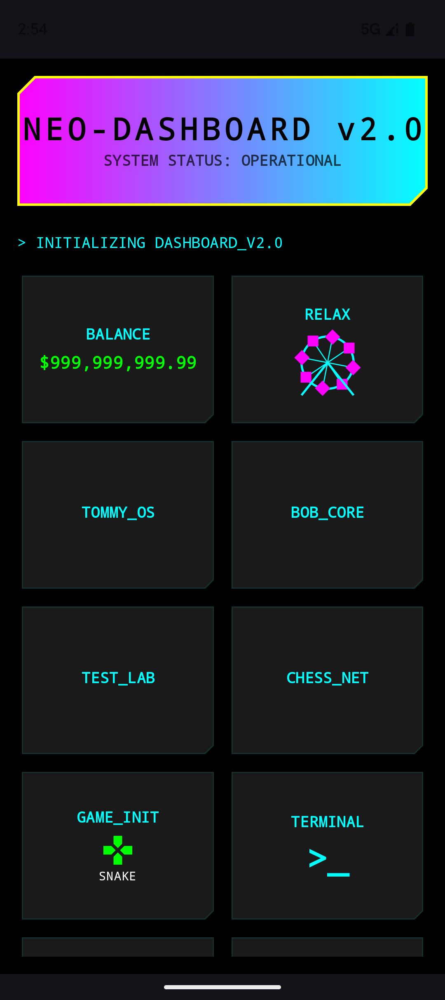

# NEO-DASHBOARD v2.0

A high-performance, cyberpunk-themed Android dashboard protocol.

## Features
- **NEO_DAW**: Integrated Digital Audio Workstation with real-time synth engine.
- **SNAKE_PROTOCOL**: Classic arcade interface for system stress testing.
- **TASK_MANIFEST**: Terminal-style task management system.
- **TERMINAL**: Direct uplink to system shell.
- **WEALTH_GEN**: Proprietary capital accumulation algorithm.
- **RELAX**: Visual kinetic feedback module (Ferris Wheel).

## Interface

## System Requirements
- Android OS: API Level 36 (v1.1)
- Architecture: 64-bit Neo-Core compatible
- Memory: Minimum 4GB Virtual RAM

## Initialization
1. Execute `ESTABLISH_UPLINK` on Login Screen.
2. Access `DASHBOARD_V2.0` interface.
3. Select required protocol tile.

---
*Created by MenkeTechnologies*
